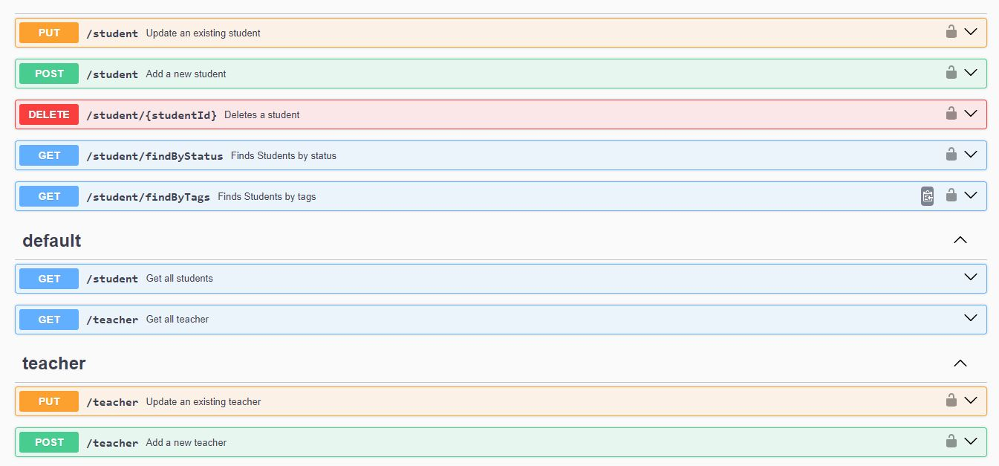

# OpenAPI Specification YAML Script with Swagger UI

This repository contains a YAML script used for creating an OpenAPI specification for a RESTful API.

## Repository Description

This repository is about a specification for 'Student' and 'Teacher' with the corresponding methods.

## Swagger UI Preview

You can preview and interact with the API as defined by this YAML script using [Swagger UI](https://swagger.io/tools/swagger-ui/).

Here is a screenshot of what the Swagger UI looks like:

## Installation 

To work with this script, you are required to have Swagger UI, which can be installed from [here](https://swagger.io/tools/swagger-ui/).
